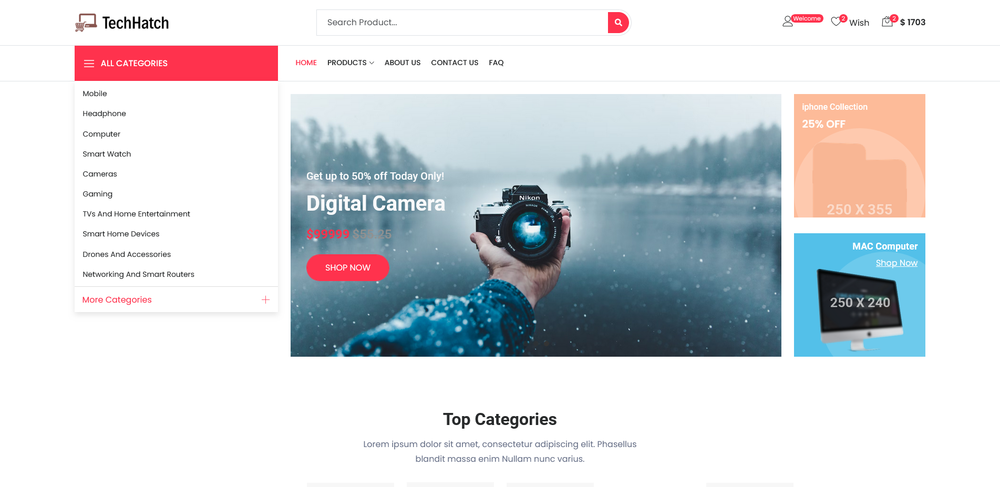
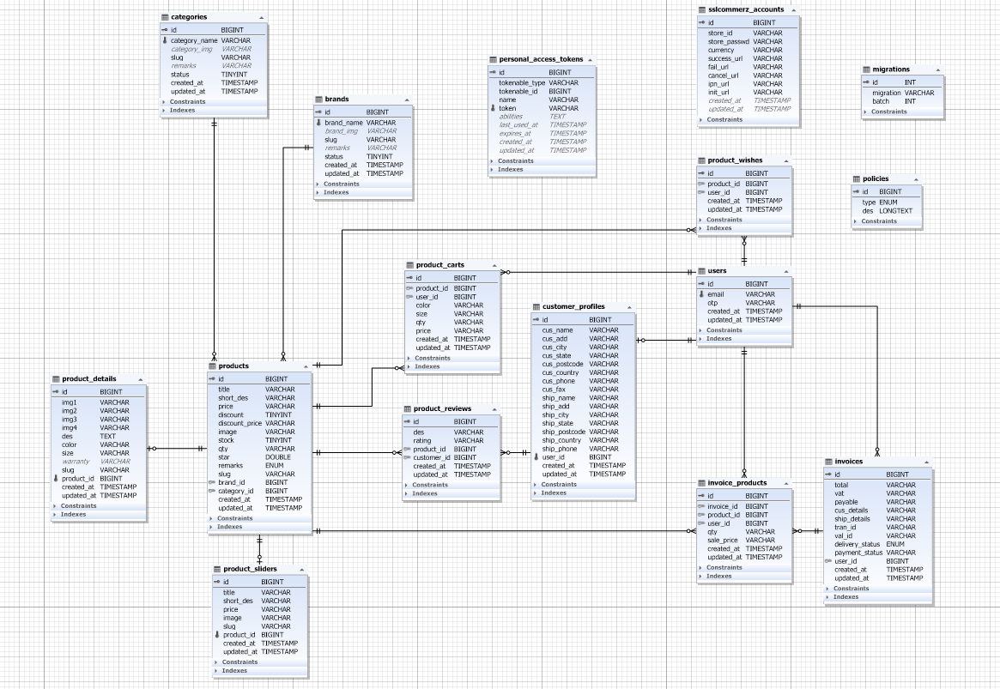

<!-- PROJECT LOGO -->
<br />
<div align="center">
  <a href="">
    
  </a>

<h2 align="center"> TechHatch: Ecommerce Website</h2>

  <p align="center">TechHatch is a robust Ecommerce platform meticulously crafted with 
a focus on seamless user experience and cutting-edge technology. The website features
a dynamic combination of a PHP Laravel back-end paired with a MySQL database, 
following a sophisticated API-first approach for enhanced scalability. </p>


<a href="http://techhatch-ecom.great-site.net/">View Demo</a>
</div>


<!-- TABLE OF CONTENTS -->
<details>
  <summary>Table of Contents</summary>
  <ol>
    <li>
      <a href="#about-the-project">About The Project</a>
    </li>
    <li>
      <a href="#getting-started">Getting Started</a>
    </li>
    <li><a href="#product-requirement-and-roadmap">Product Requirement and Roadmap
</a></li>
    <li><a href="#database-design">Database Design</a></li>
    <li><a href="#contact">Contact</a></li>
    <li><a href="#acknowledgments">Acknowledgments</a></li>
  </ol>
</details>


<!-- ABOUT THE PROJECT -->

## About The Project




<p align="right">(<a href="#readme-top">back to top</a>)</p>

### Built With

* [![Laravel][Laravel.com]][Laravel-url]
* [![Bootstrap][Bootstrap.com]][Bootstrap-url]
* [![JQuery][JQuery.com]][JQuery-url]

<p align="right">(<a href="#readme-top">back to top</a>)</p>

<!-- GETTING STARTED -->

## Getting Started

### Prerequisites

* PHP 8.2.4+
* Composer (dependency manager for PHP)
* Database (MySQL/ PostgreSQL/ SQLite/ SQL Server)
* Git

### Installation

Please Follow the steps to install this project Locally.

#### 1. Clone the repo

Open your terminal and navigate to the directory where you want to install the Laravel project.
Then run the following command:

   ```sh
   git clone https://github.com/Sabbir-Hossain12/TechHatch-Ecommerce-by-Laravel.git
   ```

#### 2. Navigate to Project Directory

Move into the project directory:

   ```sh
   cd TechHatch-Ecommerce-by-Laravel
   ```

#### 3. Install Dependencies

Once you are in the project directory, use Composer to install the required dependencies:

   ```sh
   composer install
   ```

#### 4. Create Environment File

Laravel requires an environment file for configuration. Duplicate the .env.example file and save it as .env:

   ```sh
   cp .env.example .env
   ```

#### 5. Generate Application Key

Run the following command to generate a unique application key:

   ```sh
php artisan key:generate
   ```

#### 6. Run Migrations

Use the following command to run database migrations:

   ```sh
  php artisan migrate
   ```   

#### 7. Serve the Application

You can use Laravel's built-in development server to run the application locally.
Execute the following command:

```sh
php artisan serve
```   

This will start a development server, and you can access your Laravel application at http://127.0.0.1:8000 in your web
browser.
<p align="right">(<a href="#readme-top">back to top</a>)</p>


<!-- ROADMAP -->

## Project Requirement and Roadmap

* Product Listing According to Category
* Product Listing According to Brand
* Wishlist, Cart, Review
* login, Logout, My Account

### BRANDS:

1. User should browser product according to brand
2. Each brand should have a name, logo, and description.
3. Brands should be displayed alongside products to help users identify products from specific manufacturers.

### CATEGORIES

1. The system needs a category structure to organize products.
2. Categories should be easy to manage, .
3. Products should be assigned to one category.
4. User should browser product according to category.

### PRODUCTS

1. Products should have attributes such as name, description, price, and stock status.
2. Users should be able to search, filter, and sort products based on various criteria.
3. Easy section for 'popular' ,'new','top', 'special' ,'trending', 'regular'
4. Must have slider section to featured product
5. Product should have it's details & reviews
6. Similar product should listed below the one product details

### PRODUCT DETAILS

1. Detailed product pages should include comprehensive information, images, and reviews.
2. Users should be able to see product availability and related products.

### PRODUCT REVIEWS

1. Users should be able to leave reviews and ratings for products.
2. Reviews should display user names, ratings, and comments

### PRODUCT SLIDERS

1. The platform should support dynamic sliders to showcase featured products.
2. Administrators should be able to select products to be displayed in the sliders.
3. Sliders should be customizable in terms of layout and appearance.

### CUSTOMER PROFILES

1. Users should be able to create and manage their profiles.
2. Profiles should include personal information, order history, and saved addresses.
3. The platform should have easy 2 step OTP based login system

### PRODUCT CARTS

1. Users should be able to add and remove products from their shopping carts.
2. Carts should display product details, quantities, prices, and a total amount.
3. Users should have the option to save carts for later or proceed to checkout

### PRODUCT WISHES

1. Users should be able to create and manage wishlists of products.
2. Wishlists should be linked to user profiles for easy access.
3. Users should have the option to move items from their wishlist to their cart.

### INVOICES

1. Each successful transaction should generate an invoice.
2. Invoices should contain details such as order number, date, total amount, and billing information.
3. Users should be able to view and download their invoices from their accounts.

### INVOICE PRODUCTS:

1. Each invoice should list the products purchased in that transaction.
2. The list should include product names, quantities, prices, and subtotal for each item.
3. Totals should include subtotals, vat, and other charges.

### SSLCOMMERZ PAYMENT GETWAY

1. The platform needs integration with SSLCommerz for secure payments.
2. Users should be able to link their SSLCommerz accounts for seamless transactions.
3. Payment processing should be encrypted and compliant with security standards.

<p align="right">(<a href="#readme-top">back to top</a>)</p>

## Database Design




<!-- CONTACT -->

## Contact

Sabbir Hossain- h.sabbir36@yahoo.com

Project Link: https://github.com/Sabbir-Hossain12/TechHatch-Ecommerce-by-Laravel.git

<p align="right">(<a href="#readme-top">back to top</a>)</p>


<!-- ACKNOWLEDGMENTS -->

## Acknowledgments

i would like to give credit to some of the resources down below that helped my project.

* [Font Awesome](https://fontawesome.com)
* [Bootstrap](https://getbootstrap.com/)
* [DomPdf]()
* [Axios]()
* [Toastify JS]()

<p align="right">(<a href="#readme-top">back to top</a>)</p>


<!-- MARKDOWN LINKS & IMAGES -->
<!-- https://www.markdownguide.org/basic-syntax/#reference-style-links -->

[contributors-shield]: https://img.shields.io/github/contributors/othneildrew/Best-README-Template.svg?style=for-the-badge

[contributors-url]: https://github.com/othneildrew/Best-README-Template/graphs/contributors

[forks-shield]: https://img.shields.io/github/forks/othneildrew/Best-README-Template.svg?style=for-the-badge

[forks-url]: https://github.com/othneildrew/Best-README-Template/network/members

[stars-shield]: https://img.shields.io/github/stars/othneildrew/Best-README-Template.svg?style=for-the-badge

[stars-url]: https://github.com/othneildrew/Best-README-Template/stargazers

[issues-shield]: https://img.shields.io/github/issues/othneildrew/Best-README-Template.svg?style=for-the-badge

[issues-url]: https://github.com/othneildrew/Best-README-Template/issues

[license-shield]: https://img.shields.io/github/license/othneildrew/Best-README-Template.svg?style=for-the-badge

[license-url]: https://github.com/othneildrew/Best-README-Template/blob/master/LICENSE.txt

[linkedin-shield]: https://img.shields.io/badge/-LinkedIn-black.svg?style=for-the-badge&logo=linkedin&colorB=555

[linkedin-url]: https://linkedin.com/in/othneildrew

[product-screenshot]: images/screenshot.png

[Next.js]: https://img.shields.io/badge/next.js-000000?style=for-the-badge&logo=nextdotjs&logoColor=white

[Next-url]: https://nextjs.org/

[React.js]: https://img.shields.io/badge/React-20232A?style=for-the-badge&logo=react&logoColor=61DAFB

[React-url]: https://reactjs.org/

[Vue.js]: https://img.shields.io/badge/Vue.js-35495E?style=for-the-badge&logo=vuedotjs&logoColor=4FC08D

[Vue-url]: https://vuejs.org/

[Angular.io]: https://img.shields.io/badge/Angular-DD0031?style=for-the-badge&logo=angular&logoColor=white

[Angular-url]: https://angular.io/

[Svelte.dev]: https://img.shields.io/badge/Svelte-4A4A55?style=for-the-badge&logo=svelte&logoColor=FF3E00

[Svelte-url]: https://svelte.dev/

[Laravel.com]: https://img.shields.io/badge/Laravel-FF2D20?style=for-the-badge&logo=laravel&logoColor=white

[Laravel-url]: https://laravel.com

[Bootstrap.com]: https://img.shields.io/badge/Bootstrap-563D7C?style=for-the-badge&logo=bootstrap&logoColor=white

[Bootstrap-url]: https://getbootstrap.com

[JQuery.com]: https://img.shields.io/badge/jQuery-0769AD?style=for-the-badge&logo=jquery&logoColor=white

[JQuery-url]: https://jquery.com 
